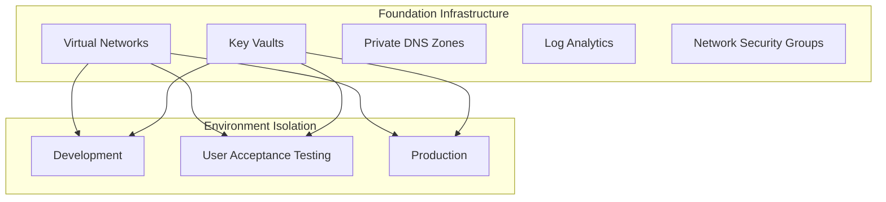
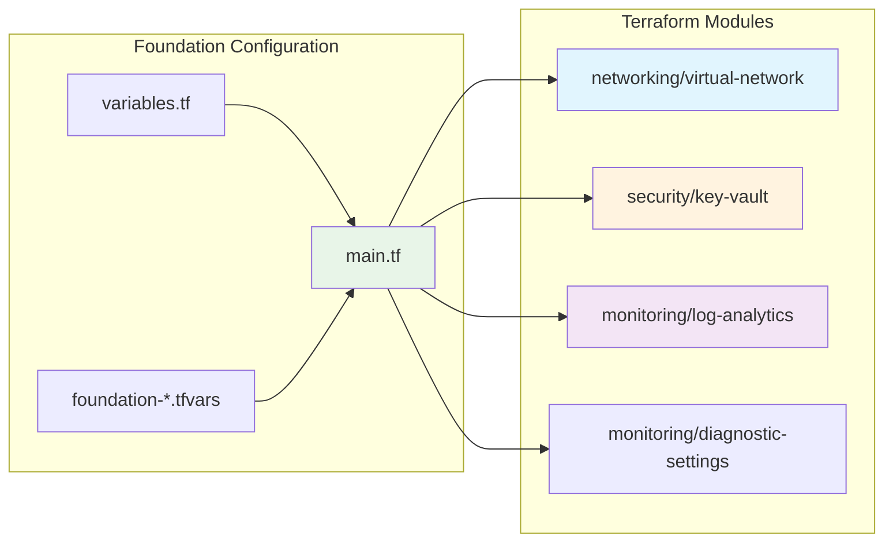

# Azure Foundation Terraform

This project provides flexible multi-environment foundation infrastructure deployments for Azure using Terraform modules and Infrastructure as Code (IaC) best practices.

## 🔄 **Deployment Modes**

### **Single Subscription Mode** (Default)
- Uses your current Azure CLI context
- All environments (Dev, UAT, Prod) in the same subscription
- Simpler setup and management

### **Multi-Subscription Mode** (Optional)
- Each environment can use a different Azure subscription
- Enhanced security and billing isolation
- Requires subscription IDs in tfvars files

> **💡 Tip:** Start with single-subscription mode and upgrade to multi-subscription when needed.

## 📁 Structure

```
azure-foundation-terraform/
├── README.md
├── DEMOS.md                          # Guide to the demo scenarios
├── AZURE-AD-AUTH-SETUP.md            # Azure AD authentication setup guide
├── foundation/                       # Foundation infrastructure deployment
│   ├── main.tf
│   ├── variables.tf
│   ├── backend.tf
│   ├── foundation-dev.tfvars
│   ├── foundation-uat.tfvars
│   └── foundation-prod.tfvars
├── modules/                          # Reusable local Terraform modules
│   ├── compute/
│   ├── foundation/
│   ├── monitoring/
│   ├── networking/
│   ├── security/
│   └── storage/
├── demo-01-local-state/              # Demo: local state basics
├── demo-02-remote-state-setup/       # Demo: remote state with Azure Storage
├── demo-02b-remote-state-azapi/      # Demo: remote state using AzAPI provider
├── demo-03-vnet-remote-state/        # Demo: VNet with remote state
├── demo-03b-vnet-with-tfvars/        # Demo: VNet using tfvars files
├── demo-04-advanced-features/        # Demo: advanced Terraform features
├── demo-05-custom-modules/           # Demo: consuming local custom modules
├── demo-06-azure-verified-modules/   # Demo: Azure Verified Modules
├── demo-07-avm-with-customization/   # Demo: AVM with customization
└── demo-08-workspaces/               # Demo: Terraform workspaces
```

## 🚀 Deployments

### Foundation Infrastructure
Common infrastructure components used across multiple environments:
- **Virtual networks and subnets** - Network foundation and segmentation
- **Network Security Groups** - Traffic filtering and security rules
- **Log Analytics workspaces** - Centralized logging and monitoring
- **Key Vaults** - Secure secrets and certificate management
- **Private DNS zones** - Internal name resolution
- **Diagnostic settings** - Resource monitoring configuration

```bash
# Deploy to development
cd foundation/
terraform apply -var-file="foundation-dev.tfvars"

# Deploy to UAT
terraform apply -var-file="foundation-uat.tfvars"

# Deploy to production
terraform apply -var-file="foundation-prod.tfvars"
```

## 🔧 Module References

This project uses local reusable modules defined in the `modules/` directory:

```hcl
module "virtual_network" {
  source = "./modules/networking/virtual-network"
  # ... configuration
}

module "key_vault" {
  source = "./modules/security/key-vault"
  # ... configuration
}
```

## 🏗️ Architecture

This project follows a **foundation infrastructure approach**:



### **Module Architecture**

```

## 🏷️ State Management

Each deployment uses unique state keys:

### Foundation Infrastructure
- **Dev**: `foundation-dev.terraform.tfstate`
- **UAT**: `foundation-uat.terraform.tfstate`
- **Prod**: `foundation-prod.terraform.tfstate`

## 🔄 CI/CD Integration

### Azure DevOps Pipelines
- **foundation-infra-pipeline.yml** - Deploys foundation infrastructure

### Pipeline Features
- Multi-environment support
- Approval gates for production
- State management
- Plan validation
- Security scanning

### Multi-Subscription Pipeline Configuration
For multi-subscription deployments, configure separate service connections in Azure DevOps:

**Service Connections Required:**
- `azure-dev-subscription` - Dev environment connection
- `azure-uat-subscription` - UAT environment connection  
- `azure-prod-subscription` - Prod environment connection

**Pipeline Variable Groups:**
Create variable groups for each environment with subscription-specific values:
```yaml
# Variable Group: foundation-dev-vars
subscription_id: "11111111-1111-1111-1111-111111111111"
service_connection: "azure-dev-subscription"

# Variable Group: foundation-uat-vars  
subscription_id: "22222222-2222-2222-2222-222222222222"
service_connection: "azure-uat-subscription"

# Variable Group: foundation-prod-vars
subscription_id: "33333333-3333-3333-3333-333333333333"
service_connection: "azure-prod-subscription"
```

## 🛡️ Security Considerations

- All secrets stored in Azure Key Vault
- Service principals with least privilege access
- Network security groups configured
- Private endpoints for secure connectivity
- Diagnostic logging enabled

## ⚙️ **Configuration Options**

### **Single Subscription Setup** (Default)
Keep `subscription_id` commented out in your `.tfvars` files - uses Azure CLI authenticated subscription:
```hcl
environment = "dev"
# subscription_id = "..."  # Commented out = uses Azure CLI context
resource_group_name = "rg-shared-dev-01"
location = "East US 2"
```

**Deploy Single Subscription:**
```bash
# Login to your target subscription
az login
az account set --subscription "your-subscription-name-or-id"

# Deploy to development
terraform init
terraform plan -var-file="foundation-dev.tfvars"
terraform apply -var-file="foundation-dev.tfvars"
```

### **Multi-Subscription Setup**
Uncomment and configure `subscription_id` in each environment's `.tfvars` file for cross-subscription deployments:

**foundation-dev.tfvars:**
```hcl
environment = "dev"
subscription_id = "11111111-1111-1111-1111-111111111111"  # Dev subscription
resource_group_name = "rg-shared-dev-01"
location = "East US 2"
```

**foundation-uat.tfvars:**
```hcl
environment = "uat"
subscription_id = "22222222-2222-2222-2222-222222222222"  # UAT subscription
resource_group_name = "rg-shared-uat-01"
location = "East US 2"
```

**foundation-prod.tfvars:**
```hcl
environment = "prod"
subscription_id = "33333333-3333-3333-3333-333333333333"  # Prod subscription
resource_group_name = "rg-shared-prod-01"
location = "East US 2"
```

**Deploy Multi-Subscription:**
```bash
# Deploy Dev environment
terraform workspace select dev || terraform workspace new dev
terraform plan -var-file="foundation-dev.tfvars"
terraform apply -var-file="foundation-dev.tfvars"

# Deploy UAT environment  
terraform workspace select uat || terraform workspace new uat
terraform plan -var-file="foundation-uat.tfvars"
terraform apply -var-file="foundation-uat.tfvars"

# Deploy Prod environment
terraform workspace select prod || terraform workspace new prod
terraform plan -var-file="foundation-prod.tfvars"
terraform apply -var-file="foundation-prod.tfvars"
```

**Prerequisites for Multi-Subscription:**
- Service Principal or user account with **Contributor** access to all target subscriptions
- Proper RBAC permissions across subscriptions
- Consistent resource naming across environments

## 🔐 Security Configuration

Core security features include:

## �📋 Prerequisites

- **Azure Subscription** with appropriate permissions
- **Terraform** >= 1.5.0
- **Azure CLI** >= 2.50.0
- **Azure DevOps** (for CI/CD pipelines)

## 🚀 Quick Start

1. **Clone the repository**
   ```bash
   git clone <repository-url>
   cd azure-enterprise-infrastructure
   ```

2. **Configure backend** (update `backend.tf` files)
   ```hcl
   backend "azurerm" {
     resource_group_name   = "rg-terraform-state"
     storage_account_name  = "your-terraform-state-storage"
     container_name        = "tfstate"
     key                   = "shared/terraform.tfstate"
   }
   ```

3. **Deploy foundation infrastructure**
   ```bash
   cd foundation/
   terraform init
   terraform plan -var-file="foundation-dev.tfvars"
   terraform apply -var-file="foundation-dev.tfvars"
   ```

## 🆘 Troubleshooting

### Common Issues
1. **State Lock Issues**: Use `terraform force-unlock` if needed
2. **Permission Errors**: Verify service principal permissions
3. **Module Not Found**: Check module source and version tags

### Getting Help
- Check pipeline logs in Azure DevOps
- Review Terraform plan output
- Consult module documentation

## 📞 **Support**

- Create an [issue](https://github.com/travishankins/azure-foundation-terraform/issues) for bug reports and feature requests
---

## 📄 License

This project is licensed under the MIT License. See the [LICENSE](LICENSE) file for details.

---

**Built with ❤️ following Azure best practices**